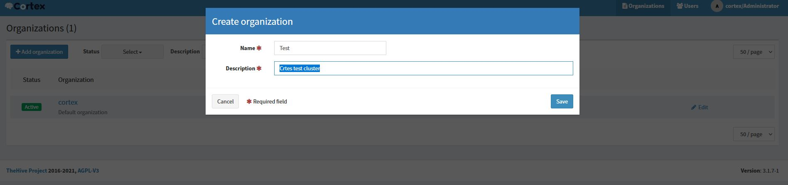
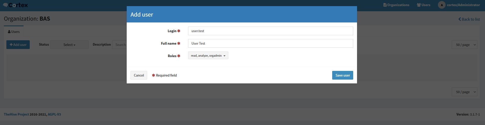
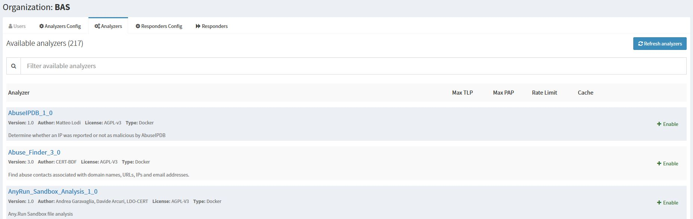

<br />
<div align="center">
  <h1 align="center">Cortex</h1>
  <p align="center">
    Installation / Configuration
</div>

NB : installation based on this tutorial https://github.com/TheHive-Project/CortexDocs/blob/master/installation/install-guide.md
## Installation
Download RPM file from Thehive project repository:
  ```sh
  wget --no-check-certificate https://rpm.thehive-project.org/release/noarch/cortex-3.1.7-1.noarch.rpm
  ```
Install package
   ```sh
  rpm --ivh cortex-3.1.7-1.noarch.rpm
  ```
  
Before start Cortex service, you should install Elasticsearch to store Cortex's data.
### Install Elasticsearch
Follow the link : https://github.com/secfit/elk/blob/main/Installation.md <br>
After successful installation, please add Elascticsearch credential informations to cortex configuration.

Edit cortex configuration file /etc/cortex/application.conf, in ElasticSearch section `search {` ,  change the ollowing parameters:
   ```sh
  host = ["127.0.0.1:9200"]
  user = "user_name"
  password = "pass_word"
  ```
Change the following values on initd file
   ```sh
  perl -pi -e 's|. /lib/init/vars.sh|[ -r /lib/init/vars.sh ] && . /lib/init/vars.sh|g' /etc/init.d/cortex
  perl -pi -e 's|. /lib/lsb/init-functions|[ -r /etc/init.d/functions ] && . /etc/init.d/functions|g' /etc/init.d/cortex
  ```
Start Cortex service
Start service
   ```sh
  systemctl start cortex
  ```
Open cortex interface for initial configuration : `http://127.0.0.1:9001/index.html#!/maintenance`<br>
the screen should be like this:


Create Administrator account : 


After creating account, you should directly invited to credential login prompt : <br>
 <br>

Create Organization:
 <br>

Go into the last organization, and create new user : 
 <br>

### Add Analyzers
Prerequirement <br>
NB : we will install pip2 and pip3, because some analyzers require pip2, and some Analyzers require pip3.
   ```sh
  yum install -y python3 python3-devel python-pip python2.7-dev
  pip3 install -U pip setuptools
  cd /opt/cortex
  git clone https://github.com/TheHive-Project/Cortex-Analyzers
  cd /opt/cortex/
  for I in $(find Cortex-Analyzers -name 'requirements.txt'); do sudo -H pip2 install -r $I; done && for I in $(find Cortex-Analyzers -name 'requirements.txt'); do sudo -H pip3.6 install -r $I || true; done && for I in $(find Cortex-Analyzers -name 'requirements.txt'); do sudo -H pip3 install -r $I || true; done
  ```

Uncomment analyzer location on Cortex config /etc/cortex/application.conf, and save.
   ```sh
  urls = ["/opt/cortex/Cortex-Analyzers/analyzers"]
  ```
  
Restart service
   ```sh
  systemctl restart cortex
  ```
Now, you should find analyzer list like this : 
 <br>
