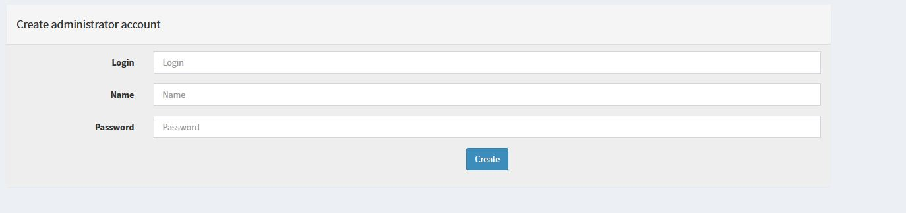

<br />
<div align="center">
  <h3 align="center">Cortex</h3>
  <p align="center">
    Installation / Configuration
</div>

## Installation
Download RPM file from Thehive project repository:
  ```sh
  wget --no-check-certificate https://rpm.thehive-project.org/release/noarch/cortex-3.1.7-1.noarch.rpm
  ```
Install package
   ```sh
  rpm --ivh cortex-3.1.7-1.noarch.rpm
  ```
Edit cortex configuration file /etc/cortex/application.conf, in ElasticSearch section `search {` ,  change the ollowing parameters:
   ```sh
  host = ["127.0.0.1:9200"]
  user = "user_name"
  password = "pass_word"
  ```
Change the following values on initd file
   ```sh
  perl -pi -e 's|. /lib/init/vars.sh|[ -r /lib/init/vars.sh ] && . /lib/init/vars.sh|g' /etc/init.d/cortex
  perl -pi -e 's|. /lib/lsb/init-functions|[ -r /etc/init.d/functions ] && . /etc/init.d/functions|g' /etc/init.d/cortex
  ```
Start service
   ```sh
  systemctl start cortex
  ```
Open cortex interface for initial configuration : `http://127.0.0.1:9001/index.html#!/maintenance`<br>
the screen should be like this:


Create Administrator account : 


After creating account, you should directly invited to credential login prompt : <br>

